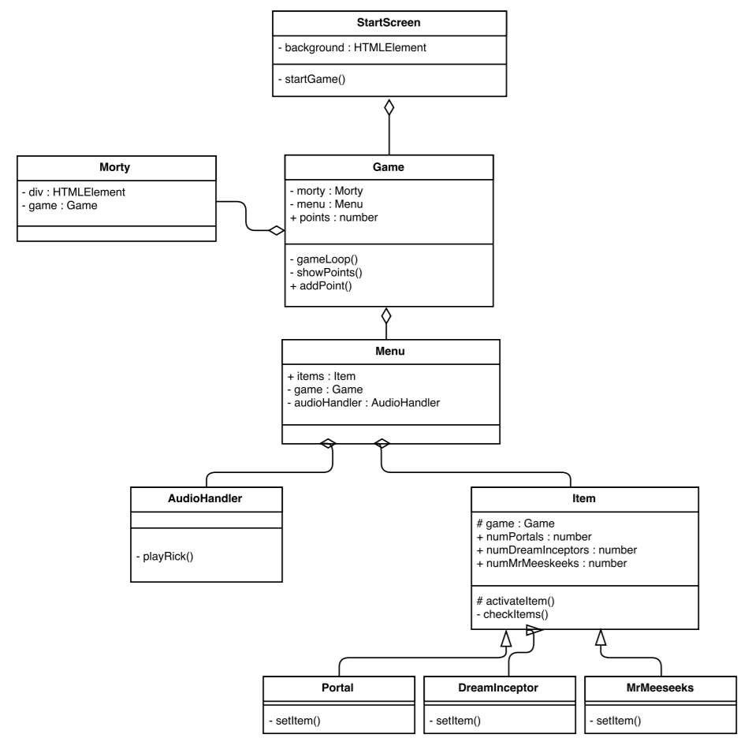

# PRG4-inleveropdracht
*Inleveropdracht Programmeren 4 - Perry Janssen 0924208*

Rick and Morty - MORTY MACHINE [clicker game] 
Test game [hier](https://perrydrums.github.io/PRG4-inleveropdracht/)

**How to Install:** 
Fork en Clone de repository. Sla deze op ergens op je PC.
De map hoeft niet in (bijvoorbeeld) een htdocs map te staan.
Navigeer naar de docs in je browser om het spelletje te spelen.

**How to edit:** 
Je mag de game zoveel aanpassen als je wilt. Alles is geprogrammeerd in TypeScript. Je hebt een TypeScript compiler nodig en een editor zoals Visual Studio Code. De .ts bestanden moeten worden opgeslagen in de 'dev' map.
   

## UML

## Classes en Instances
Alles is object georienteerd geprogrammeerd. Dit betekend dat alle code wordgt uitgevoerd door middel van Classes. Zo is de Game zijn eigen class, de 'clicker' staat in de Morty class. Alles werkt op deze manier. De classes zijn verdeeld in hun eigen bestanden. Deze staan in de 'dev' map.

## Encapsulation
In het bestand Item.ts en Items.ts wordt er gebruik gemaakt van encapsulation. De game class wordt protected meegegeven aan de children van de Item class. 

## Composition
In de Game class worden instances van meerdere classes gemaakt. Game geeft zichzelf ook mee aan die classes.

## Inheritance
In Items.ts staan meerdere classes. Deze erven allemaal over van Item.ts

  

Ik heb feedback aan Jan-Willem gegeven. [Bekijk hier](https://github.com/JWTP/PRG4GAME)

  

Programmed in OOP TypeScript.

Sounds from [www.peal.io](www.peal.io) 
Images from Google Images

